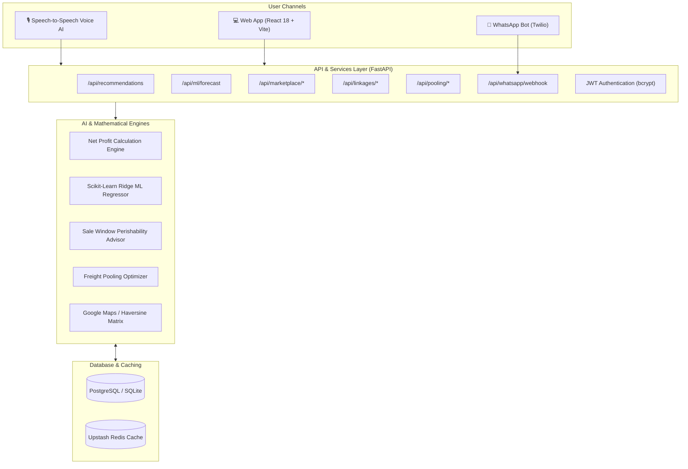

# 🌾 Smart Mandi Selection & Market Linkage Platform

[](https://smart-mandi-selection.vercel.app/)
[](https://fastapi.tiangolo.com)
[](https://react.dev)
[](https://scikit-learn.org)
[](https://www.twilio.com)
[-brightgreen.svg)]()
[]()

> 🌐 **Live Web Application:** [https://smart-mandi-selection.vercel.app/](https://smart-mandi-selection.vercel.app/)  
> 📖 **API Documentation (Swagger):** [https://smart-mandi-selection.onrender.com/docs](https://smart-mandi-selection.onrender.com/docs)  
> 📄 **Official User Manual (PDF):** [Smart_Mandi_Selection_User_Manual.pdf](./Smart_Mandi_Selection_User_Manual.pdf)  
> 🎯 **SIH Problem Statement ID:** **26132** (*"Strengthening market linkages and price discovery for farmers"*)  
> 👨‍💻 **Architected & Engineered by:** **Devansh Rahatal**

---

## 🌟 The Core Problem: "The Gross Price Illusion"

Agricultural portals (e-NAM, Agmarknet) only display **Gross Advertised Modal Prices**. Smallholders travel long distances chasing higher advertised prices, only to suffer net losses after factoring in transport freight, loading/unloading fees, APMC mandi commissions, and produce transit spoilage.

### Real Scenario: Jaipur Tomato Farmer (20 Quintals)
| Market | Advertised Modal Price | Transport Fee | Mandi Commission | Spoilage Loss | Real Net Take-Home | True Financial Outcome |
|---|:---:|:---:|:---:|:---:|:---:|:---:|
| **Kota Krishi Mandi** | ₹2,450/q | -₹484/q | -₹110/q | -₹79/q | **₹1,737.16/q** | 🥇 **HIGHEST NET EARNING** (+₹3,382 in pocket) |
| **Azadpur (Delhi)** | ₹2,901/q | -₹927/q | -₹218/q | -₹119/q | **₹1,568.06/q** | 🥈 Misleading Gross Price (-₹3,382 loss) |
| **Vashi (Mumbai)** | ₹2,820/q | -₹2,347/q | -₹197/q | -₹420/q | **₹0.00/q** | ❌ Severe Freight Loss |

---

## 📐 Mathematical Formulation: Net Take-Home Profit

$$\text{Net Profit} = P_{\text{modal}} \times M_{\text{grade}} - \Big(C_{\text{transport}} + C_{\text{handling}} + C_{\text{commission}} + C_{\text{spoilage}}\Big)$$

- **Agricultural Quality Grade Multiplier ($M_{\text{grade}}$)**:
  - **Grade A (Premium / Export)**: $1.10\times$ (+10% premium)
  - **Grade B (FAQ Standard)**: $1.00\times$ (Standard baseline)
  - **Grade C (Processing / Second)**: $0.80\times$ (-20% discount)
- **Biological Transit Spoilage Loss**:
  $$C_{\text{spoilage}} = P_{\text{modal}} \times I_{\text{perish}} \times \left(\frac{T_{\text{transit}}}{24}\right) \times 0.15$$
  - $I_{\text{perish}}$: Perishability Index (Tomato: $0.85$, Onion: $0.25$, Potato: $0.20$, Wheat: $0.05$, Banana: $0.70$)
  - $T_{\text{transit}}$: Driving duration computed via Google Maps / Haversine with national highway detour factor ($1.28\times$).

---

## 🏛️ Comprehensive 10-Pillar Platform Blueprint (SIH PS 26132)

```
                                 SMART MANDI ECOSYSTEM
                                           │
  ┌──────────────────┬─────────────────────┼────────────────────┬─────────────────┐
  ▼                  ▼                     ▼                    ▼                 ▼
[Price Discovery]  [Predictive ML]    [B2B Marketplace]    [Logistics Pool]  [Escrow & Storage]
• 5-Factor Net     • Scikit-Learn     • Verified Buyer     • Kisan Pool      • WDRA Warehouses
  Profit Engine      Ridge Regressor    Directory            45-60% Freight    • Storage ROI Calc
• Quality Grading  • 7-Day Forecast   • Harvest Lot          Savings         • 4-Stage Escrow
• Geographical     • 95% Confidence     Creator            • Regional Hub    • Printable QR
  Profit Map         Intervals        • Digital Bidding      Aggregation       e-Receipts
```

### 1. Real Take-Home Price Discovery & Profit Map (`/map`)
- Calculates exact net cash after transport, commission, handling, and spoilage across candidate mandis.
- Interactive GIS Leaflet map with color-coded profit pins and road routing.

### 2. Scikit-Learn Machine Learning Price Forecaster (`/admin/mandis`)
- Ridge Regressor with exponential time-decay weights ($\lambda=10.0$) computing $R^2$ accuracy, RMSE, and 7-day predicted price trajectories.

### 3. AI Harvest Sale-Window Advisor
- Evaluates perishability biological decay and price momentum ($\frac{\Delta P}{\Delta t}$) to recommend optimal sale windows (*"Sell in 24–36h"* vs *"Hold for 3–5 days"*).

### 4. Direct Farmer-Buyer Marketplace (`/marketplace`)
- Searchable directory of verified corporate buyers & aggregators with GST validation templates, ratings, and 1-click WhatsApp connect.
- Farmers list harvest lots (Grade A/B/C); corporate buyers place digital purchase bids with 1-click **"Accept & Lock Deal ✓"**.

### 5. Kisan Pool Logistics Aggregator (`/pooling`)
- Aggregates smallholder harvest batches ($5-25\text{q}$) onto commercial trucks, slashing freight expenses by **45% to 60%**.

### 6. Post-Harvest Storage & WDRA Warehouses (`/storage`)
- Maps nearby cold storages & dry silos with rates (₹/q/mo) and an interactive **Storage ROI Calculator** to eliminate distress sales during harvest gluts.

### 7. Guaranteed Escrow Settlement & Digital Receipts (`/orders`)
- 4-stage visual milestone pipeline (`ESCROW_LOCKED` $\rightarrow$ `QC_PASSED` $\rightarrow$ `DISPATCHED` $\rightarrow$ `SETTLED`).
- Generates downloadable, printable digital sale receipts with **encrypted QR verification codes**.

### 8. Dispute & Grievance Redressal Portal (`/grievance`)
- 1-click ticket filing for weighbridge fraud, illegal commissions, or payment delays with official APMC resolution tracking.

### 9. Multi-Lingual Regional Voice AI & WhatsApp Bot
- In-browser Speech-to-Speech Voice AI assistant + Twilio WhatsApp bot supporting **English, Hindi (हिंदी), Marathi (मराठी), and Gujarati (ગુજરાતી)**.

### 10. Dual-Theme Engine & Administrative Controls
- Zero-flash Dark Mode & Government Light Mode with full APMC cost configuration and audit reporting.

---

## 🏗️ System Architecture



---

## 🚀 Quickstart Guide

### Prerequisites
- Python 3.11+
- Node.js 18+ (or Node 20+)

### 1. Backend Setup
```powershell
cd backend
python -m venv .venv
.venv\Scripts\activate
pip install -r requirements.txt
```

Create `backend/.env`:
```env
DATABASE_URL=sqlite:///./smart_mandi.db
JWT_SECRET_KEY=smart-mandi-sih-2026-secret
PORT=8000
```

Start Backend:
```powershell
uvicorn app.main:app --reload --port 8000
```
- Interactive Swagger API Docs: **http://localhost:8000/docs**

---

### 2. Frontend Setup
```powershell
cd frontend
npm install
npm run dev
```
- Web Application: **http://localhost:5173**
- Default Admin Login: `admin` / `admin123`

---

### 3. Automated Test Suite (38 / 38 Passing)
```powershell
cd backend
.venv\Scripts\pytest
```
```
======================== 38 passed in 9.74s (100% success rate) ========================
```

---

## 📡 REST API Reference

| Method | Endpoint | Description | Status |
|---|---|---|:---:|
| `POST` | `/api/recommendations` | Computes ranked net take-home profit across candidate mandis | Active |
| `GET` | `/api/ml/forecast/{mandi_id}/{crop_id}` | Scikit-Learn 7-day price regression with $R^2$ and RMSE | Active |
| `GET` | `/api/marketplace/buyers` | Lists verified corporate buyers and procurement requirements | Active |
| `POST` | `/api/marketplace/lots` | Publishes farmer harvest lots with quality grades (A/B/C) | Active |
| `PATCH` | `/api/marketplace/offers/{id}/action` | Accepts or rejects digital purchase bids (locks deal) | Active |
| `GET` | `/api/linkages/warehouses` | Maps WDRA cold storages with road distance and rates | Active |
| `GET` | `/api/linkages/transactions` | Lists escrow payment milestone orders and e-receipts | Active |
| `POST` | `/api/linkages/disputes` | Files farmer grievance tickets for APMC investigation | Active |
| `GET` | `/api/linkages/arrival-influx/{mandi}/{crop}` | Calculates arrival volumes and supply pressure risk | Active |
| `POST` | `/api/pooling/recommendations` | Calculates smallholder shared freight savings (45-60%) | Active |
| `POST` | `/api/whatsapp/webhook` | Multi-lingual Twilio WhatsApp conversational bot | Active |

---

## 👨‍💻 Project Lead & Creator

* **Lead Architect & Full-Stack Engineer:** **Devansh Rahatal**  
* **Project:** Smart Mandi Selection & Market Linkage Platform  
* **Smart India Hackathon 2026 — Problem Statement ID:** **26132**
