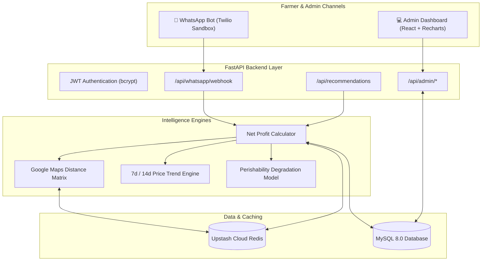

# 🌾 Smart Mandi Selection Intelligence Platform

[](https://fastapi.tiangolo.com)
[](https://react.dev)
[](https://www.mysql.com)
[](https://upstash.com)
[](https://www.twilio.com)
[-brightgreen.svg)]()

> **Smart India Hackathon (SIH 2026)**  
> *Helping farmers maximize real take-home earnings by calculating Net Profit (Price minus Transport, Handling, Mandi Commission, and Transit Spoilage) across candidate markets.*

---

## 🌟 The Core Problem: "The Price Illusion"

Agricultural portals typically show only **Gross Modal Price**. Farmers travel long distances chasing higher advertised prices, only to suffer net financial losses due to transport fees, APMC mandi commissions, and produce spoilage in transit.

### Example Case Study: Jaipur Tomato Farmer (20 Quintals)
| Market | Advertised Price | Transport | Commission | Spoilage | Net Take-Home | Outcome |
|---|:---:|:---:|:---:|:---:|:---:|:---:|
| **Kota Krishi Mandi** | ₹2,450/q | -₹484/q | -₹110/q | -₹79/q | **₹1,737.16/q** | 🥇 **BEST PROFIT** (+₹3,382 total) |
| **Azadpur (Delhi)** | ₹2,901/q | -₹927/q | -₹218/q | -₹119/q | **₹1,568.06/q** | 🥈 Misleading Gross Price |
| **Vashi (Mumbai)** | ₹2,820/q | -₹2,347/q | -₹197/q | -₹420/q | **₹0.00/q** | ❌ Net Loss |

---

## 📐 Net Profit Mathematical Formulation

$$\text{Net Profit} = P_{\text{modal}} - \Big(C_{\text{transport}} + C_{\text{handling}} + C_{\text{commission}} + C_{\text{spoilage}}\Big)$$

- **Transit Spoilage Deduction**:
  $$C_{\text{spoilage}} = P_{\text{modal}} \times I_{\text{perish}} \times \left(\frac{T_{\text{transit}}}{24}\right) \times 0.15$$
  - $I_{\text{perish}}$: Perishability Index (Tomato: $0.85$, Onion: $0.25$, Potato: $0.20$, Wheat: $0.05$, Banana: $0.70$)
  - $T_{\text{transit}}$: Travel duration in hours calculated via Google Maps Matrix API or Haversine with Indian Highway detour multiplier ($1.28\times$).

---

## 🏗️ System Architecture



---

## 🚀 Quickstart Guide

### Prerequisites
- Python 3.11+
- Node.js 18+ (or Node 20+)
- MySQL 8.0 running on `localhost:3306`

### 1. Backend Setup
```powershell
cd backend
python -m venv .venv
.venv\Scripts\activate
pip install -r requirements.txt
```

Create `backend/.env`:
```env
DATABASE_URL=mysql+pymysql://root:<your_password>@localhost:3306/smart_mandi
REDIS_URL=rediss://default:<token>@<upstash_host>:6379
GOOGLE_MAPS_API_KEY=<your_google_maps_key>
JWT_SECRET_KEY=smart-mandi-secret-key-2026
```

Seed Database & Start Backend:
```powershell
python -m scripts.seed_data
uvicorn app.main:app --reload --port 8000
```
- API Docs: **http://localhost:8000/docs**

---

### 2. Frontend Setup
```powershell
cd frontend
npm install
npm run dev
```
- Website: **http://localhost:5173**
- Admin Portal: **http://localhost:5173/admin/login**  
  *(Credentials: `admin` / `admin123`)*

---

### 3. WhatsApp Bot Testing
1. **Interactive Terminal Flow**:
   ```powershell
   cd backend
   python -m scripts.verify_whatsapp
   ```
2. **Live Smartphone Testing (Twilio Sandbox)**:
   - Expose backend: `npx -y localtunnel --port 8000`
   - In Twilio Sandbox Settings, paste: `https://<tunnel-subdomain>.loca.lt/api/whatsapp/webhook`
   - Send `Hi` from your phone to Twilio's WhatsApp number!

---

### 4. Running Automated Tests
```powershell
cd backend
pytest -s tests/
```
Output: `16 passed in 3.01s (100% success rate)`

---

## 📦 Docker Deployment

Run the complete multi-container stack with a single command:
```powershell
docker-compose up --build
```
- Frontend: **http://localhost:5173**
- Backend API: **http://localhost:8000**
- MySQL: `localhost:3306`
- Redis: `localhost:6379`

---

## 📡 REST API Reference

| Method | Endpoint | Description | Auth |
|---|---|---|:---:|
| `GET` | `/api/health` | Service health & component status | Public |
| `GET` | `/api/crops` | List supported crops & perishability index | Public |
| `GET` | `/api/mandis` | List all active mandis with coordinates | Public |
| `POST` | `/api/recommendations` | Calculate ranked net profit recommendations | Public |
| `POST` | `/api/whatsapp/webhook` | Twilio incoming WhatsApp webhook | Public |
| `POST` | `/api/whatsapp/simulate` | Interactive WhatsApp simulator for testing | Public |
| `POST` | `/api/admin/login` | Admin login & JWT token issuance | Public |
| `GET` | `/api/admin/overview` | Platform analytics & live query stream | Bearer |
| `GET` | `/api/admin/mandis` | Mandis list with editable cost configs | Bearer |
| `PUT` | `/api/admin/mandis/{id}/cost-config` | Update commission %, loading, transport rates | Bearer |
| `GET` | `/api/admin/price-history/{mandi_id}/{crop_id}` | 30-day historical price points for charts | Bearer |
| `GET` | `/api/admin/export-report` | Download complete market report as CSV | Bearer |

---

## 👥 Contributors & Acknowledgements
- **Smart India Hackathon 2026**
- Agmarknet & Ministry of Agriculture & Farmers Welfare for open market price datasets.
