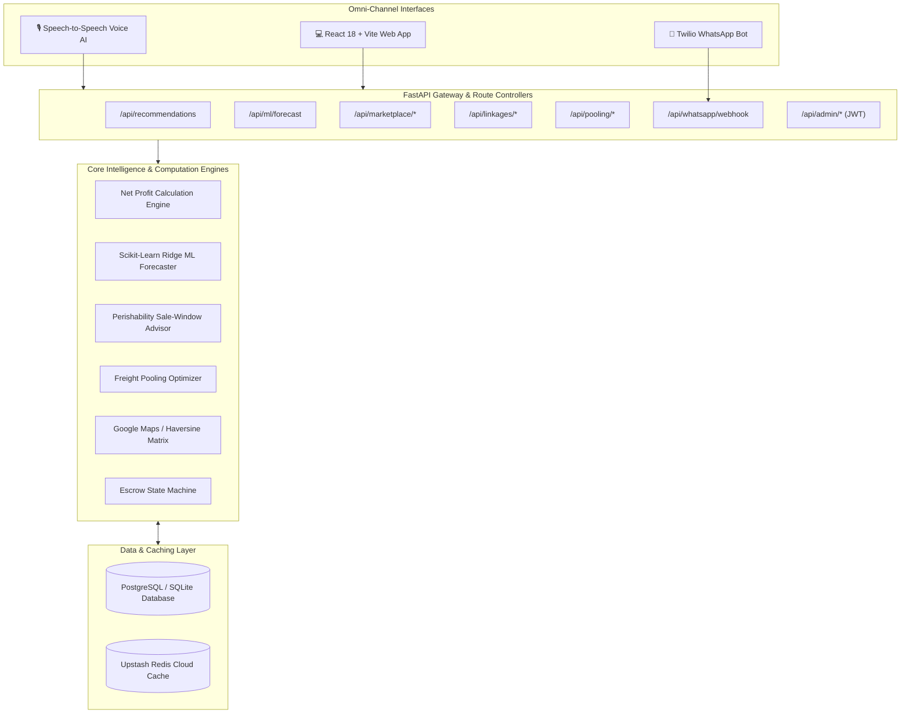
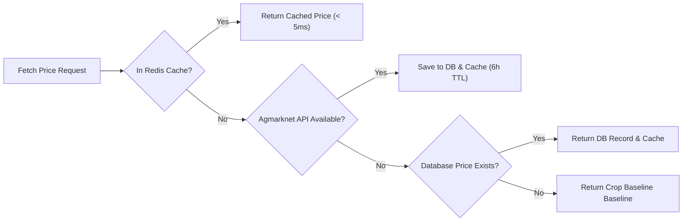

# 🏛️ Smart Mandi Selection — System Architecture & Technical Specifications

> **Smart India Hackathon 2026**  
> **Problem Statement ID**: **26132** (*"Strengthening market linkages and price discovery for farmers"*)  
> **Architect & Lead Developer**: **Devansh Rahatal**

---

## 1. Complete System Architecture Diagram

---

## 2. Mathematical Formulations & ML Logic

### A. Net Profit Optimization Formula
$$\text{Net Profit} = P_{\text{modal}} \times M_{\text{grade}} - \Big(C_{\text{transport}} + C_{\text{handling}} + C_{\text{commission}} + C_{\text{spoilage}}\Big)$$

- **Quality Multiplier ($M_{\text{grade}}$)**: Grade A ($1.10\times$), Grade B ($1.00\times$), Grade C ($0.80\times$).
- **Handling Charges ($C_{\text{handling}}$)**: Localized palledari and mandi entry fee per quintal.
- **APMC Commission ($C_{\text{commission}}$)**: $P_{\text{modal}} \times \frac{\text{Commission \%}}{100}$.

### B. Biological Transit Spoilage Loss
$$C_{\text{spoilage}} = P_{\text{modal}} \times I_{\text{perish}} \times \left(\frac{T_{\text{transit}}}{24}\right) \times 0.15$$

- $I_{\text{perish}}$: Perishability Index ($0.85$ for Tomato, $0.25$ for Onion, $0.20$ for Potato, $0.05$ for Wheat, $0.70$ for Banana).
- $T_{\text{transit}}$: Estimated driving duration ($T_{\text{transit}} = \frac{\text{Road Distance}}{40\text{ km/h}}$).

### C. Scikit-Learn 7-Day Machine Learning Regression
$$\hat{y}(t) = \beta_0 + \beta_1 t, \quad \min_{\beta} \sum_{i=1}^n w_i \left(y_i - (\beta_0 + \beta_1 t_i)\right)^2 + \alpha \|\beta\|_2^2$$
- Sample weights $w_i = \exp\left(-\frac{\text{age}_i}{\lambda}\right)$ with half-life decay $\lambda=10.0$ giving primary weight to recent market momentum.
- Statistical metrics calculated:
  - **Coefficient of Determination ($R^2$)**: $1 - \frac{\sum (y_i - \hat{y}_i)^2}{\sum (y_i - \bar{y})^2}$
  - **Root Mean Squared Error (RMSE)**: $\sqrt{\frac{1}{n} \sum (y_i - \hat{y}_i)^2}$
  - **95% Confidence Interval**: $\hat{y} \pm 1.96 \cdot \text{RMSE}$

---

## 3. Micro-Engine Specifications

| Module | Core Functionality | Primary Technologies |
|---|---|---|
| **Price Engine** | 5-factor net take-home calculation across mandis | Python, NumPy, Pandas |
| **ML Engine** | 7-day price regression with exponential time decay | Scikit-Learn, NumPy |
| **Marketplace** | Farmer lot creation & digital corporate bidding | FastAPI, SQLAlchemy ORM |
| **Kisan Pool** | Smallholder freight clustering (45-60% savings) | Greedy Bin-Packing Algorithm |
| **Cold Storage** | Distance-based WDRA mapping & Storage ROI | Haversine Formula, OSRM |
| **Escrow Engine** | 4-stage payment tracking & QR e-Receipt generation | Cryptographic UUID, Canvas |
| **Voice AI** | Speech-to-Speech regional voice assistance | Web Speech API, gTTS, SpeechRecognition |
| **WhatsApp Bot** | 4-language conversational NLP bot | Twilio API, Python Regex NLP |

---

## 4. Multi-Tier Data Ingestion & Fallback Strategy

---

## 5. Security & Cryptographic Standards
- **Authentication**: JWT (JSON Web Tokens) with HS256 algorithm and bcrypt password hashing.
- **Escrow Verification**: SHA-256 / UUID alphanumeric hash embedded into printable e-Receipt QR codes.
- **Data Compliance**: Modeled after e-NAM & RBI Nodal Escrow guidelines for seamless integration with banking webhook APIs.
