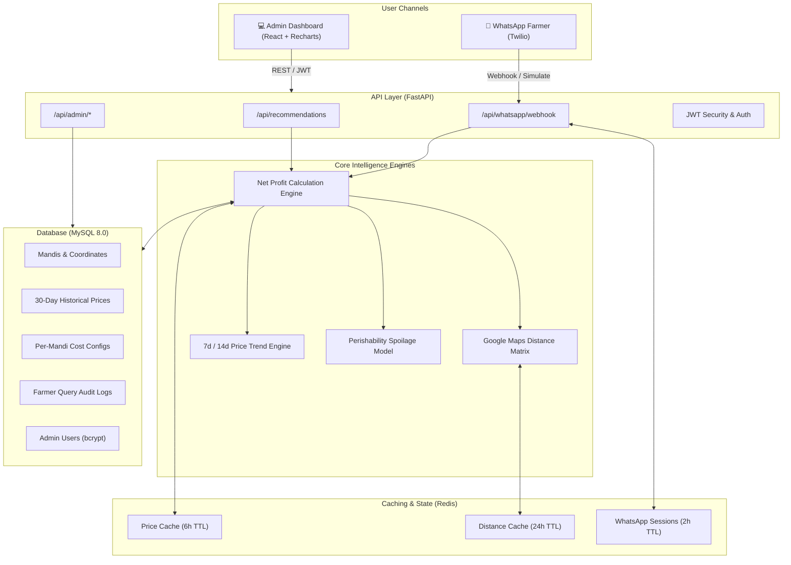
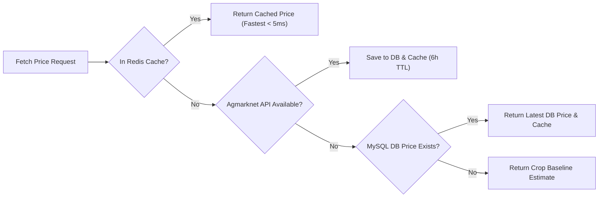
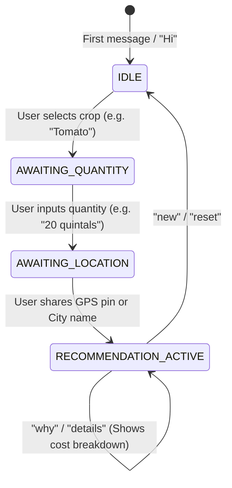

# Smart Mandi Selection — System Architecture & Technical Specifications

> **Smart India Hackathon (SIH 2026)**  
> **Problem Statement**: Intelligent agricultural marketplace recommendation system calculating true net farmer profit.

---

## 1. High-Level System Architecture

---

## 2. Net Profit Optimization Formula

A fundamental flaw in existing agricultural portals (like e-NAM and Agmarknet) is that they only display **Gross Modal Price**. Farmers travel long distances chasing a higher price, only to discover that transport fees, mandi commissions, and spoilage losses resulted in a lower net return.

$$\text{Net Profit} = \text{Modal Price} - \Big(\text{Transport Cost} + \text{Loading/Unloading} + \text{Mandi Commission} + \text{Spoilage Risk}\Big)$$

### Mathematical Parameter Definitions

| Variable | Description | Formula / Standard Baseline |
|----------|-------------|-----------------------------|
| $P_{\text{modal}}$ | Modal market price of crop | ₹ / quintal |
| $C_{\text{transport}}$ | Road transit haulage fee | $\text{Distance (km)} \times \text{Rate (₹/km/q)}$ |
| $C_{\text{handling}}$ | Mandi loading + unloading charge | ₹ / quintal (configured per mandi) |
| $C_{\text{commission}}$ | APMC Mandi fee percentage | $P_{\text{modal}} \times \frac{\text{Commission \%}}{100}$ |
| $C_{\text{spoilage}}$ | Transit value loss due to decay | $P_{\text{modal}} \times I_{\text{perish}} \times \left(\frac{T_{\text{transit}}}{24}\right) \times 0.15$ |

Where:
- $I_{\text{perish}}$: Crop perishability index ($0.05$ for durable grains like Wheat, up to $0.85$ for perishables like Tomato).
- $T_{\text{transit}}$: Travel duration in hours ($T_{\text{transit}} = \frac{\text{Road Distance}}{40\text{ km/h}}$).
- $0.15$: Standard maximum single-day degradation ceiling without active refrigeration.

---

## 3. Multi-Tier Data Ingestion & Fallback Cascade

To ensure 100% uptime even when external government APIs undergo maintenance:

---

## 4. Geospatial Distance & Highway Modeling

- **Tier 1 — Google Maps Distance Matrix API**: Fetches real-time driving distances and traffic-adjusted travel durations.
- **Tier 2 — Redis Geospatial Cache (24h TTL)**: Caches `(lat1, lon1) -> (lat2, lon2)` pairs to minimize API billing.
- **Tier 3 — Haversine Formula with Indian Road Detour Factor**:
  $$d = 2r \arcsin\left(\sqrt{\sin^2\left(\frac{\Delta\phi}{2}\right) + \cos(\phi_1)\cos(\phi_2)\sin^2\left(\frac{\Delta\lambda}{2}\right)}\right)$$
  $$\text{Road Distance} = d \times 1.28 \quad (\text{Indian National Highway Detour Multiplier})$$
  $$\text{Travel Time} = \frac{\text{Road Distance}}{40\text{ km/h}} \quad (\text{Medium Commercial Vehicle Speed})$$

---

## 5. Conversational WhatsApp State Machine

- **Natural Language Parsing**: Supports Hindi aliases (*pyaaz*, *aloo*, *tamatar*, *gehu*, *kanda*, *batata*) and various units (*kg*, *quintals*, *tonnes*).
- **Session Persistence**: Farmers' conversational context is maintained in Redis with 2-hour TTL.
